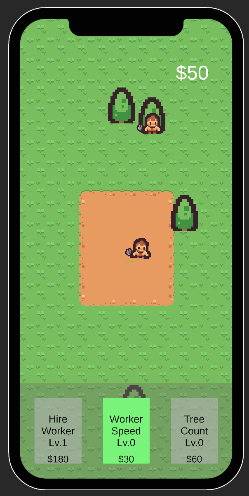
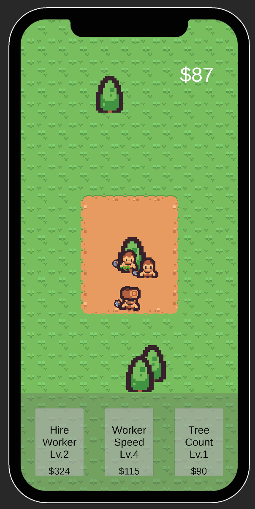
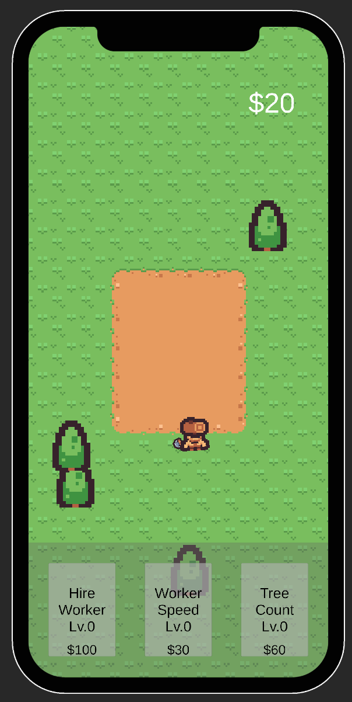
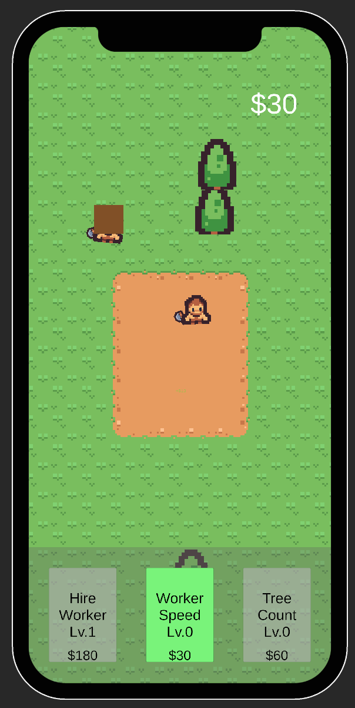
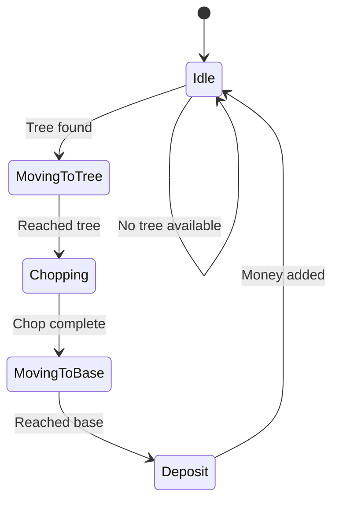
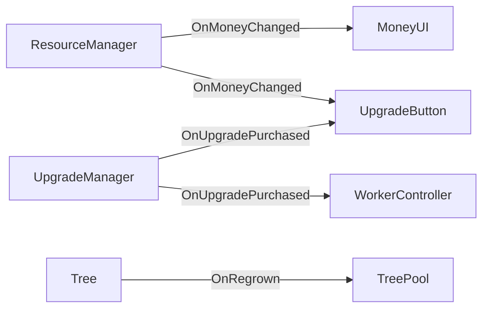

# Lumberjack Idle

A 2D idle/tycoon game built with **Unity 2022** showcasing clean architecture, design patterns, and modern Unity packages. Workers autonomously chop trees, carry logs to base, and earn money — while players upgrade their lumber empire.

<p align="center">
  
  
</p>
<p align="center">
  
  
</p>

---

## Features

- **Autonomous Worker AI** — Finite State Machine drives worker behavior (idle, move, chop, carry, deposit)
- **Economy System** — Observable resource manager with event-driven UI updates
- **Upgrade System** — Data-driven upgrades via ScriptableObjects (worker speed, hire workers)
- **Object Pooling** — Efficient tree management with pooled regrowth
- **Polish & Juice** — PrimeTween animations: walk wobble, tree shake, log carry, floating "+$" text

---

## Architecture

### Dependency Injection (VContainer)

All managers and UI components are registered in a single composition root. Runtime-spawned workers receive dependencies automatically via `IObjectResolver`.

```
GameLifetimeScope (Composition Root)
├── ResourceManager    → IResourceManager
├── UpgradeManager     → IUpgradeManager
├── MoneyUI            (MonoBehaviour)
├── UpgradeUI          (MonoBehaviour)
├── WorkerController   (MonoBehaviour)
├── WorkerSpawner      (Factory)
└── TreePool           (Object Pool)
```

### Worker AI — Finite State Machine



Each state implements the `IState` interface (`Enter`, `Execute`, `Exit`) and transitions are managed by `WorkerController.ChangeState()`. Workers use **NavMeshAgent** for 2D pathfinding.

| State | Behavior |
|-------|----------|
| **Idle** | Scans for nearest available tree, reserves it |
| **MovingToTree** | Navigates to tree's chop point, walk wobble animation |
| **Chopping** | Timer-based chopping with periodic tree shake VFX |
| **MovingToBase** | Returns to base carrying a log, walk wobble animation |
| **Deposit** | Deposits log, adds money, spawns floating text |

### Observer Pattern (C# Events)



UI components subscribe to manager events and update reactively — no polling, no tight coupling.

### Factory Pattern (Worker Spawning)

`WorkerSpawner` uses VContainer's `IObjectResolver` to instantiate worker prefabs at runtime with full DI support. When the "Hire Worker" upgrade is purchased, a new worker is spawned with all dependencies injected automatically.

---

## Tech Stack

| Technology | Purpose |
|-----------|---------|
| **Unity 2022.3 LTS** | Game engine |
| **VContainer** | Lightweight dependency injection |
| **PrimeTween** | High-performance tweening (animations, VFX) |
| **UniTask** | Async/await for Unity (tree regrowth, timers) |
| **NavMeshPlus** | 2D navigation mesh for worker pathfinding |
| **TextMeshPro** | UI text rendering |
| **ScriptableObjects** | Data-driven upgrade configuration |

---

## Project Structure

```
Assets/_Project/
├── Scripts/
│   ├── Core/
│   │   └── GameLifetimeScope.cs      # DI composition root
│   ├── Entities/
│   │   ├── WorkerController.cs        # Worker FSM + NavMesh agent
│   │   ├── Tree.cs                    # Tree with chop/regrow cycle
│   │   ├── TreePool.cs                # Object pooling for trees
│   │   ├── WorkerSpawner.cs           # Factory with DI support
│   │   ├── LogCarrier.cs              # Visual log carry system
│   │   ├── IState.cs                  # State interface
│   │   └── States/
│   │       ├── IdleState.cs
│   │       ├── MovingToTreeState.cs
│   │       ├── ChopingState.cs
│   │       ├── MovingToBaseState.cs
│   │       └── DepositState.cs
│   ├── Managers/
│   │   ├── IResourceManager.cs        # Interface + events
│   │   ├── ResourceManager.cs         # Economy implementation
│   │   ├── IUpgradeManager.cs         # Interface + events
│   │   └── UpgradeManager.cs          # Upgrade logic
│   └── UI/
│       ├── MoneyUI.cs                 # Event-driven money display
│       ├── FloatingText.cs            # Animated "+$" fly-to-UI text
│       ├── UpgradeUI.cs               # Upgrade panel manager
│       └── UpgradeButton.cs           # Individual upgrade with animations
├── ScriptableObjects/
│   └── UpgradeData.cs                 # Upgrade type, cost curve, values
├── Prefabs/
│   ├── Lumberjack.prefab
│   ├── Tree.prefab
│   └── FloatingText.prefab
└── Art/
    └── LogSprite.png
```

---

## Design Patterns Used

| Pattern | Where | Why |
|---------|-------|-----|
| **State Machine** | Worker AI | Clean separation of behavior per state, easy to extend |
| **Observer** | Events (OnMoneyChanged, OnUpgradePurchased, OnRegrown) | Decoupled communication between systems |
| **Dependency Injection** | VContainer + GameLifetimeScope | Testable, loosely coupled architecture |
| **Factory** | WorkerSpawner | Runtime object creation with automatic DI |
| **Object Pool** | TreePool | Efficient reuse of tree instances |
| **Data-Driven Design** | UpgradeData ScriptableObjects | Configure upgrades without code changes |

---

## Getting Started

1. Clone the repository
2. Open with **Unity 2022.3** or later
3. Open `Assets/_Project/Scenes/GameScene.unity`
4. Press Play

---

## License

This project is a portfolio demo. Feel free to use it as a learning reference.
